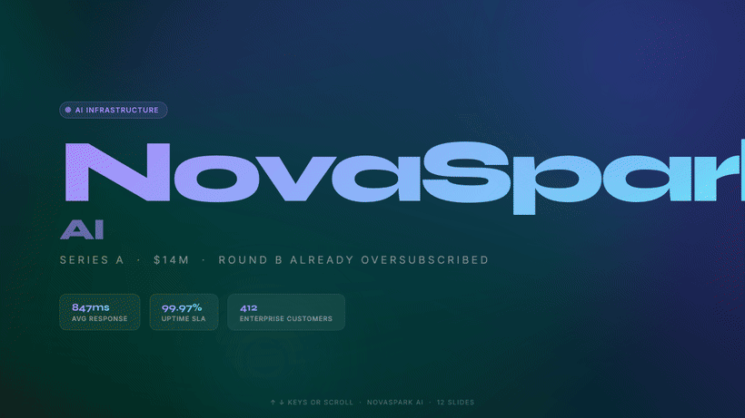

# presentation-md

**Schema-crafted decks for AI agents — 75 themes, editable PPTX, MCP tools. Built to beat prompt-only slide packs.**

[](https://www.npmjs.com/package/@presentation-md/core)
[](https://pypi.org/project/presentation-md-render/)
[](https://github.com/isatimur/presentation-md/actions/workflows/ci.yml)
[](https://presentation-md.vercel.app/#gallery)
[](LICENSE)

<p align="center">
  
  <br/>
  <em>Same Deck JSON → 75 themes. HTML craft + native PowerPoint. No screenshots, no lock-in.</em>
</p>

🌐 **[Live gallery](https://presentation-md.vercel.app)** · **[Studio](https://presentation-md.vercel.app/studio)** · **[vs frontend-slides](https://presentation-md.vercel.app/vs/frontend-slides)**

> ⭐ If this turned your notes into a deck you'd actually present, star the repo.

---

## Quick start

```bash
npx @presentation-md/install claude-code
# also: cursor | copilot | codex | gemini-cli | cli
# Claude Code plugin: /slides <brief> (marketplace) — same skill + MCP
```

Restart your agent and ask: *create a presentation about…*  
You get validated Deck JSON → self-contained HTML → editable **PowerPoint** (opens in Keynote; imports to Google Slides).

Demo without installing: open the [gallery](https://presentation-md.vercel.app/#gallery) or [Studio](https://presentation-md.vercel.app/studio).

---

## Why presentation-md wins vs frontend-slides

[frontend-slides](https://github.com/zarazhangrui/frontend-slides) is a strong **discovery / vibe** pack — prompt templates and bold looks. presentation-md keeps that energy and adds the product layer agents need to ship decks for real:

| | presentation-md | frontend-slides |
|---|---|---|
| **Themes** | **75** published + create-from-brand | Style presets / template pack |
| **Discovery** | Studio **mood browse chips** (site parity) + **Compare 3** (safe/bold/wildcard fill) + MCP `list_themes` **browse** chips + **`suggested_preview` trio** + **pick-3 / Generate / Example shared-iframe shot strips** (Title/Bento/Compare scroll-crop densified) + Example **Compare 3 themes** bridge + CLI `--preview-compare` **PNGs** + `preview_themes` **inline PNGs** + **auto-layouts** + `file_url`/`compare_summary` DX | Live style gallery (strong) |
| **One-shot quality** | Anti-slop + stunning-25-first + density lock + `audit_deck`/`judge_deck` + **`apply_safe_fixes`** | Anti-slop rules; no shared audit product |
| **Authoring model** | Schema-validated **Deck JSON** agents can diff/edit one slide | Prompt → HTML (harder to surgically edit) |
| **Layouts** | **18** craft layouts + `custom-html` recipes (`ranked-list`, `logo-wall`, `streak-grid`, `metric-ring`, `chart`, `custom-html`, `image-hero`, bento, comparison, code…) | Template-driven HTML |
| **MCP** | Typed tools: render, export, audit, judge, preview, import PPTX/Markdown, brand theme | — |
| **Export** | Native editable **PPTX** ↔ Deck JSON round-trip | HTML-first |
| **Proofs** | **75/75** structured gallery + Studio live preview | Showcase templates |
| **Install** | `npx @presentation-md/install <agent>` + Claude `/slides` plugin | Clone / copy skill |

Also beats Gamma / Slidev / Marp on the agent path: structured JSON (not opaque slides), any coding agent (not one app), and PowerPoint you can still edit.

---

## What it is

A universal skill layer for Claude Code, Cursor, Codex, Gemini CLI, Copilot, and plain CLI. The agent writes Deck JSON; `@presentation-md/render` emits self-contained HTML; `@presentation-md/export` maps every layout to native PowerPoint shapes; Studio edits with live preview. Themes are swappable npm packages.

Also ships **[deck-design-judge](skills/deck-design-judge)** (contrast / overflow gates + rubric) and optional multi-model scoring. Benchmark: [swiirl-deck-benchmark.vercel.app](https://swiirl-deck-benchmark.vercel.app). Provenance: [ATTRIBUTION.md](ATTRIBUTION.md).

---

## Packages

| Package | Description |
|---|---|
| [`@presentation-md/core`](packages/core) | Deck + theme schemas, theme loader, validator, and bundled default-tech theme |
| [`@presentation-md/render`](packages/renderer-node) | Node.js renderer — CLI (`presentation-md-render`) + programmatic API |
| [`@presentation-md/export`](packages/export) | PPTX round-trip — Deck JSON ↔ editable PowerPoint (`.pptx`) |
| [`@presentation-md/studio`](packages/studio) | Browser editor — hosted at [presentation-md.vercel.app/studio](https://presentation-md.vercel.app/studio) (in-repo; not published to npm) |
| [`@presentation-md/mcp-server`](packages/mcp-server) | MCP server exposing all tools to any MCP-compatible agent (`presentation-md-mcp`) |
| [`@presentation-md/install`](packages/install) | One-command installer that wires the skill + MCP server into your agent (`presentation-md-install`) |
| [`@presentation-md/create-theme`](packages/create-theme) | Scaffold a new publishable theme package (`create-presentation-md-theme`), interactively or from a brand's URL/CSS (`--from-url`/`--from-css`) |
| [`@presentation-md/theme-corporate`](packages/themes/corporate) | Formal corporate theme |
| [`@presentation-md/theme-playful`](packages/themes/playful) | Playful creative-agency theme |
| [`@presentation-md/theme-luxury-minimalist`](packages/themes/luxury-minimalist) | Luxury minimalist theme |
| [`@presentation-md/theme-retro-arcade`](packages/themes/retro-arcade) | Retro 80s arcade theme |
| [`@presentation-md/theme-editorial-serif`](packages/themes/editorial-serif) | Magazine-editorial theme |
| [`@presentation-md/theme-brutalist-mono`](packages/themes/brutalist-mono) | Raw brutalist monospace theme |
| [`@presentation-md/theme-pastel-dreamy`](packages/themes/pastel-dreamy) | Soft pastel dreamy theme |
| [`@presentation-md/theme-aurora-glass`](packages/themes/aurora-glass) | Dark aurora glassmorphism |
| [`@presentation-md/theme-ft-editorial`](packages/themes/ft-editorial) | FT-inspired broadsheet |
| [`@presentation-md/theme-genz-bento`](packages/themes/genz-bento) | Gen-Z hard-shadow bento |
| [`@presentation-md/theme-crt-terminal`](packages/themes/crt-terminal) | CRT phosphor terminal |
| [`@presentation-md/theme-swiss-typographic`](packages/themes/swiss-typographic) | Swiss International Style grid |
| [`@presentation-md/theme-candy-pop`](packages/themes/candy-pop) | Candy pop soft blobs |
| [`@presentation-md/theme-aerospace-hud`](packages/themes/aerospace-hud) | Aerospace HUD / cockpit |
| [`@presentation-md/theme-brutalist-acid`](packages/themes/brutalist-acid) | Dark acid brutalist |
| [`@presentation-md/theme-bauhaus`](packages/themes/bauhaus) | Bauhaus primary geometry |
| [`@presentation-md/theme-y2k-aero`](packages/themes/y2k-aero) | Y2K aero bubbles |
| [`@presentation-md/theme-risograph-zine`](packages/themes/risograph-zine) | Risograph print-shop zine |
| [`@presentation-md/theme-neon-noir`](packages/themes/neon-noir) | Neon noir night rain |
| [`@presentation-md/theme-vaporwave`](packages/themes/vaporwave) | Vaporwave sunset grid |
| [`@presentation-md/theme-botanical-luxe`](packages/themes/botanical-luxe) | Botanical forest + gold |
| [`@presentation-md/theme-heritage-editorial`](packages/themes/heritage-editorial) | Heritage parchment + terracotta |
| [`@presentation-md/theme-fintech-clean`](packages/themes/fintech-clean) | Fintech violet + mint |
| [`@presentation-md/theme-developer-dark`](packages/themes/developer-dark) | GitHub-night developer |
| [`@presentation-md/theme-data-editorial`](packages/themes/data-editorial) | Data report editorial |
| [`@presentation-md/theme-scandinavian`](packages/themes/scandinavian) | Scandinavian hygge |
| [`@presentation-md/theme-art-deco`](packages/themes/art-deco) | Art Deco emerald + gold |
| [`@presentation-md/theme-kinetic-wrapped`](packages/themes/kinetic-wrapped) | Kinetic year-in-review |
| [`@presentation-md/theme-blueprint`](packages/themes/blueprint) | Engineering blueprint |
| [`@presentation-md/theme-glassmorphism`](packages/themes/glassmorphism) | Soft glass / icy mist |
| [`@presentation-md/theme-broadsheet`](packages/themes/broadsheet) | Newspaper broadsheet |
| [`@presentation-md/theme-soft-editorial`](packages/themes/soft-editorial) | Soft Editorial theme |
| [`@presentation-md/theme-editorial-forest`](packages/themes/editorial-forest) | Editorial Forest theme |
| [`@presentation-md/theme-pin-and-paper`](packages/themes/pin-and-paper) | Pin & Paper theme |
| [`@presentation-md/theme-vellum`](packages/themes/vellum) | Vellum theme |
| [`@presentation-md/theme-neo-grid-bold`](packages/themes/neo-grid-bold) | Neo-Grid Bold theme |
| [`@presentation-md/theme-editorial-tri-tone`](packages/themes/editorial-tri-tone) | Editorial Tri-Tone theme |
| [`@presentation-md/theme-creative-mode`](packages/themes/creative-mode) | Creative Mode theme |
| [`@presentation-md/theme-broadside`](packages/themes/broadside) | Broadside theme |
| [`@presentation-md/theme-bold-signal`](packages/themes/bold-signal) | Bold Signal theme |
| [`@presentation-md/theme-notebook-tabs`](packages/themes/notebook-tabs) | Notebook Tabs theme |
| [`@presentation-md/theme-creative-voltage`](packages/themes/creative-voltage) | Creative Voltage theme |
| [`@presentation-md/theme-signal`](packages/themes/signal) | Signal theme |
| [`@presentation-md/theme-electric-studio`](packages/themes/electric-studio) | Electric Studio theme |
| [`@presentation-md/theme-dark-botanical`](packages/themes/dark-botanical) | Dark Botanical theme |
| [`@presentation-md/theme-pastel-geometry`](packages/themes/pastel-geometry) | Pastel Geometry theme |
| [`@presentation-md/theme-split-pastel`](packages/themes/split-pastel) | Split Pastel theme |
| [`@presentation-md/theme-vintage-editorial`](packages/themes/vintage-editorial) | Vintage Editorial theme |
| [`@presentation-md/theme-paper-ink`](packages/themes/paper-ink) | Paper & Ink theme |
| [`@presentation-md/theme-biennale-yellow`](packages/themes/biennale-yellow) | Biennale Yellow theme |
| [`@presentation-md/theme-bold-poster`](packages/themes/bold-poster) | Bold Poster theme |
| [`@presentation-md/theme-coral`](packages/themes/coral) | Coral theme |
| [`@presentation-md/theme-emerald-editorial`](packages/themes/emerald-editorial) | Emerald Editorial theme |
| [`@presentation-md/theme-sakura-chroma`](packages/themes/sakura-chroma) | Sakura Chroma theme |
| [`@presentation-md/theme-pink-script`](packages/themes/pink-script) | Pink Script theme |
| [`@presentation-md/theme-block-frame`](packages/themes/block-frame) | BlockFrame theme |
| [`@presentation-md/theme-capsule`](packages/themes/capsule) | Capsule theme |
| [`@presentation-md/theme-cobalt-grid`](packages/themes/cobalt-grid) | Cobalt Grid theme |
| [`@presentation-md/theme-8-bit-orbit`](packages/themes/8-bit-orbit) | 8-Bit Orbit theme |
| [`@presentation-md/theme-mat`](packages/themes/mat) | Mat theme |
| [`@presentation-md/theme-retro-zine`](packages/themes/retro-zine) | Retro Zine theme |
| [`@presentation-md/theme-daisy-days`](packages/themes/daisy-days) | Daisy Days theme |
| [`@presentation-md/theme-blue-professional`](packages/themes/blue-professional) | Blue Professional theme |
| [`@presentation-md/theme-monochrome`](packages/themes/monochrome) | Monochrome theme |
| [`@presentation-md/theme-cartesian`](packages/themes/cartesian) | Cartesian theme |
| [`@presentation-md/theme-stencil-tablet`](packages/themes/stencil-tablet) | Stencil & Tablet theme |
| [`@presentation-md/theme-long-table`](packages/themes/long-table) | Long Table theme |
| [`@presentation-md/theme-raw-grid`](packages/themes/raw-grid) | Raw Grid theme |
| [`@presentation-md/theme-retro-windows`](packages/themes/retro-windows) | Retro Windows theme |
| [`@presentation-md/theme-peoples-platform`](packages/themes/peoples-platform) | People's Platform theme |
| [`@presentation-md/theme-scatterbrain`](packages/themes/scatterbrain) | Scatterbrain theme |
| [`@presentation-md/theme-grove`](packages/themes/grove) | Grove theme |
| [`@presentation-md/theme-studio`](packages/themes/studio) | Studio theme |
| [`presentation-md-render`](packages/renderer-python) _(PyPI)_ | Python renderer for agents and pipelines running outside Node.js |

---

## Themes

**75 themes** ship as `@presentation-md/theme-*` packages — from `default-tech` and `corporate` through editorial systems (`soft-editorial`, `editorial-forest`, `vellum`), bold frontend-slides fidelity packs (`mat`, `grove`, `signal`, `bold-signal`), and loud craft surfaces (`neon-noir`, `crt-terminal`, `brutalist-acid`).

Browse live proofs: [gallery](https://presentation-md.vercel.app/#gallery) · theme catalog in [`packages/core/references/themes.md`](packages/core/references/themes.md).

Need a theme that isn't here? `create-presentation-md-theme --from-url <site>` or `--from-css <file>`
generates one from any brand's live site or CSS in seconds — see
[`@presentation-md/create-theme`](packages/create-theme).

---

## Adapters

| Adapter | Description | Install |
|---|---|---|
| `claude-code` | Copies skill to `~/.claude/skills/` + registers MCP server in `~/.claude/mcp.json` | `npx @presentation-md/install claude-code` |
| `cursor` | Adds `.mdc` rule to `~/.cursor/rules/` + MCP server entry | `npx @presentation-md/install cursor` |
| `copilot` | Writes to `.github/copilot-instructions.md` + `.vscode/mcp.json` (run from project root) | `npx @presentation-md/install copilot` |
| `codex` | Adds skill to `~/.codex/instructions.md` + MCP server | `npx @presentation-md/install codex` |
| `gemini-cli` | Writes GEMINI.md skill to `~/.gemini/instructions/` + MCP server | `npx @presentation-md/install gemini-cli` |
| `cli` | Standalone — renders decks via the `presentation-md-render` CLI, no MCP | `npx @presentation-md/install cli` |

---

## Deck JSON example

```json
{
  "type": "deck",
  "meta": {
    "title": "Q3 Product Review",
    "company": "Acme Inc.",
    "theme": "corporate"
  },
  "slides": [
    {
      "layout": "title",
      "heading": "Q3 Product Review",
      "lead": "July – September 2026",
      "notes": "Open with the headline number, then land the theme of the quarter."
    },
    {
      "layout": "image-hero",
      "eyebrow": "Product",
      "heading": "The work, in one frame",
      "lead": "Ship velocity you can see.",
      "image": "https://images.unsplash.com/photo-1551434678-e076c223a692?w=1600",
      "imageAlt": "Team collaborating around a laptop"
    },
    {
      "layout": "stat-row",
      "heading": "By the numbers",
      "stats": [
        { "label": "MRR", "value": "$420k" },
        { "label": "Active users", "value": "12,400" },
        { "label": "NPS", "value": "67" }
      ]
    },
    {
      "layout": "two-column",
      "heading": "What we shipped",
      "body": "**Instant replay** — re-watch any session segment in one click.\n\n**Smart digest** — daily AI summary delivered to Slack.",
      "aside": "**API v2** — REST + webhook parity.\n\n**iOS widgets** — glanceable stats on the lock screen.",
      "ratio": "2-1",
      "notes": "Spend time on Instant replay — demo if possible."
    },
    {
      "layout": "comparison",
      "heading": "Before vs after",
      "leftLabel": "Before",
      "left": "Manual decks, inconsistent themes, no PPTX handoff.",
      "rightLabel": "After",
      "right": "Schema-validated Deck JSON, 75 themes, native PowerPoint.",
      "emphasis": "right"
    },
    {
      "layout": "feature-grid",
      "heading": "Upcoming in Q4",
      "columns": "bento",
      "cards": [
        { "title": "Real-time co-editing", "body": "Multiple agents annotating the same deck." },
        { "title": "Theme marketplace", "body": "Install community themes from the CLI." },
        { "title": "PDF export", "body": "Headless export via Playwright." },
        { "title": "Enterprise SSO", "body": "SAML 2.0 + SCIM for large orgs." },
        { "title": "Presenter polish", "body": "Notes drawer + craft knobs in Studio." }
      ]
    },
    {
      "layout": "quote",
      "quote": "The best presentation is the one that actually gets made.",
      "by": "Every engineer who missed a deadline"
    },
    {
      "layout": "timeline",
      "heading": "Q4 milestones",
      "steps": [
        { "title": "Oct 15 — Co-editing beta", "body": "Invite-only for design partners." },
        { "title": "Nov 1 — Theme marketplace", "body": "Browse and install from the CLI." },
        { "title": "Nov 20 — PDF export GA", "body": "One-command headless export." },
        { "title": "Dec 10 — Enterprise SSO", "body": "SAML 2.0 + SCIM provisioning." }
      ]
    },
    {
      "layout": "data-table",
      "heading": "Regional breakdown",
      "columns": ["Region", "MRR", "Growth"],
      "rows": [
        ["North America", "$210k", "+22%"],
        ["Europe", "$140k", "+15%"],
        ["APAC", "$70k", "+41%"]
      ]
    },
    {
      "layout": "closing",
      "heading": "Questions?",
      "lead": "deck source at github.com/isatimur/presentation-md",
      "notes": "Leave five minutes for Q&A."
    }
  ]
}
```

---

## Import from PowerPoint

Bring an existing `.pptx` back into Deck JSON for editing, re-theming, or agent iteration:

```bash
# CLI
presentation-md-render --from-pptx board-deck.pptx -o deck.json --theme corporate
```

Agents can call the `import_pptx` MCP tool. Fidelity notes (layouts, images, speaker notes) live in
[`packages/core/references/pptx-import.md`](packages/core/references/pptx-import.md).

## Export to PowerPoint, Keynote & Google Slides

Because a deck is *structured* data (not free-form HTML), every slide maps cleanly to native
slide shapes. One exporter covers all three apps:

```bash
# CLI
presentation-md-render deck.json --format pptx -o deck.pptx
presentation-md-render deck.json --format pdf -o deck.pdf
```

```ts
// Programmatic (Node)
import { renderDeckPptx, renderDeckPdf } from "@presentation-md/render";
await writeFile("deck.pptx", await renderDeckPptx(deckJson));
await writeFile("deck.pdf", await renderDeckPdf(deckJson));
```

The result is a **native, editable** `.pptx`:

- **PowerPoint** — opens directly.
- **Keynote** — File → Open (Keynote has no portable native format; `.pptx` is the bridge).
- **Google Slides** — File → Import slides / upload to Drive → opens as an editable Slides deck.

Agents can call the `export_deck` MCP tool (`format: "pptx" | "html" | "pdf"`). PDF uses Chromium's print pipeline (vector, selectable text). Fidelity notes (fonts, colors, images) live in
[`packages/export/references/pptx-fidelity.md`](packages/export/references/pptx-fidelity.md).

## Studio

[`@presentation-md/studio`](packages/studio) is a browser editor: edit a deck through
schema-driven forms, see a live preview, and download HTML or `.pptx`. It's a fully static Vite SPA
(client-side render + export, no backend).

```bash
pnpm --filter @presentation-md/studio dev           # local editor
pnpm --filter @presentation-md/studio build:web   # static build → web/studio/ (Vercel)
```

## MCP tools

| Tool | Purpose |
|---|---|
| `render_deck` | Render a Deck JSON string to a self-contained HTML file |
| `export_deck` | Export a Deck JSON to native PowerPoint (`.pptx`), vector PDF, or html |
| `audit_deck` | Schema-validate + craft gates; optional `apply_safe_fixes` returns repaired JSON |
| `judge_deck` | Design judge — t0/t1 JSON gates; **t2** HTML metrics + Chrome shots; **t3** panel/agent rubric |
| `list_themes` | Enumerate available themes (bundled + installed) with name, version, and vibe |
| `apply_theme` | Swap `meta.theme` on a deck without rewriting slides |
| `generate_deck_prompt` | Build a generation prompt wired to a theme + schema |
| `import_pptx` | Import a `.pptx` into Deck JSON |
| `import_markdown` | Convert Markdown (+ optional front matter) into Deck JSON |
| `preview_themes` | Render 1–3 theme previews; optional `mode: "layouts"` for multi-slide craft bake |
| `import_brand_theme` | Generate a theme from a brand URL or CSS file |

---

## Contributing

See [CONTRIBUTING.md](CONTRIBUTING.md).

---

## License

MIT — see [LICENSE](LICENSE).
